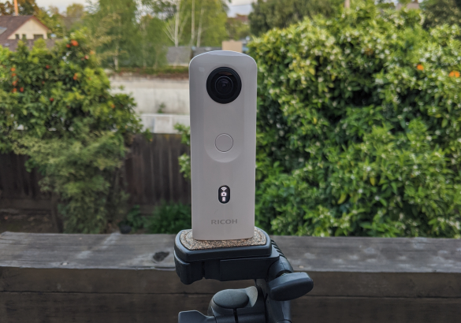

# RICOH THETA SC2 Image Test



RICOH THETA API test to show how to check if image has  
finished processing and is available for download. Take picture.  Wait for it to process, then display.


```
I/flutter (20524): Test of taking picture and then checking to see if picture is ready for download
I/flutter (20524): ---
I/flutter (20524): The HTTP response code is: 200
I/flutter (20524): The HTTP response from camera.takePicture is:
I/flutter (20524): {
I/flutter (20524):   "name": "camera.takePicture",
I/flutter (20524):   "id": "269",
I/flutter (20524):   "progress": {
I/flutter (20524):     "completion": 0.0
I/flutter (20524):   },
I/flutter (20524):   "state": "inProgress"
I/flutter (20524): }
I/flutter (20524): The status ID is 269
I/flutter (20524): Elapsed time: 0 seconds. State: inProgress
I/flutter (20524): Elapsed time: 1 seconds. State: inProgress
I/flutter (20524): Elapsed time: 2 seconds. State: inProgress
I/flutter (20524): Elapsed time: 3 seconds. State: inProgress
I/flutter (20524): Elapsed time: 4 seconds. State: inProgress
I/flutter (20524): Elapsed time: 5 seconds. State: inProgress
I/flutter (20524): Elapsed time: 6 seconds. State: inProgress
I/flutter (20524): Elapsed time: 7 seconds. State: done
I/flutter (20524): picture ready for download
I/flutter (20524): Image is available at thi URL
I/flutter (20524): http://192.168.1.1/files/thetasc26c21a247d9055838792badc5/100RICOH/R0010049.JPG
```

